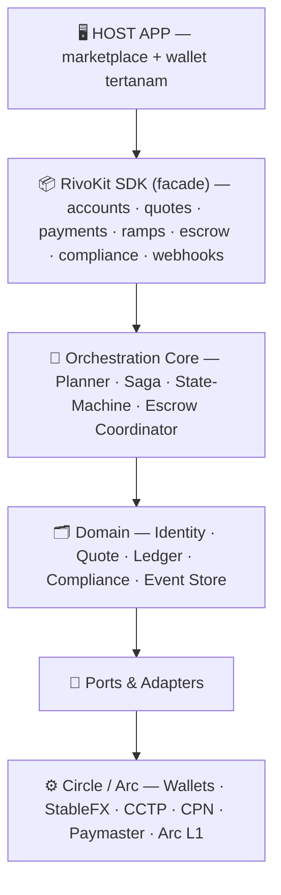
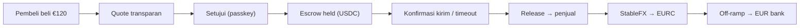

<div align="center">

# 🌊 RivoKit

### One intent. Every rail. Settled.
**_Where money finds its way._**

The non-custodial money-movement layer for stablecoins — built on **Arc** & **Circle**.

[](https://arc.io)
[]()
[]()
[]()

</div>

---

## Apa itu RivoKit?

RivoKit adalah **SDK** yang mengubah primitif pembayaran Circle (App Kit, StableFX, CCTP/Gateway, CPN, Circle Wallets, Paymaster) menjadi **satu permukaan berbasis-*intent***. Alih-alih menyusun sendiri swap, bridge, escrow, dan off-ramp, developer cukup menyatakan tujuan:

```ts
await rivo.pay({ to: "seller", amount: { amount: "120.00", currency: "EUR" } });
```

RivoKit yang memutuskan **rute mana, dalam urutan apa**, menjalankannya lintas beberapa rel, **memulihkan diri saat sebagian gagal**, dan membukukan **siapa membayar siapa** secara kriptografis — semuanya di balik satu panggilan.

> **Analogi:** kalau StableFX adalah meja FX antar-bank, RivoKit adalah Stripe/Wise — lapisan yang membuat rel-rel itu bisa dipakai dalam beberapa baris kode.

---

## Masalah yang diselesaikan

Pembeli di AS punya **USDC**. Penjual di Berlin ingin **EUR yang bisa dicairkan** dan tak mau mengurus wallet/exchange. Di rel tradisional, menjembatani keduanya lambat, mahal, dan penuh perantara.

RivoKit menyelesaikan penuh alurnya: **USDC → (FX) → EURC → (off-ramp) → EUR di bank**, dengan escrow non-custodial di tengah dan penjual yang tak pernah menyentuh crypto.

---

## Fitur

- 🎯 **Intent-based** — nyatakan tujuan, bukan primitif. Crypto tersembunyi total dari user.
- 🧭 **Routing otomatis** — Planner memilih P2P / FX / bridge / off-ramp di tiga dimensi (chain × mata uang × bentuk).
- 🔒 **Escrow non-custodial** — kontrak memegang dana; platform tak pernah bisa memindahkannya sepihak. Tujuan dipatok ke pembeli/penjual.
- 🔁 **Keandalan multi-leg (Saga)** — forward-retry / kompensasi / resting-state; dana tak pernah hilang di tengah jalan.
- 🧾 **Atribusi kriptografis** — buktikan siapa membayar order mana **tanpa memo/invoice**, bahkan untuk dua pembeli & barang identik.
- 🌉 **Cross-chain** — ingress dari Base/Solana via CCTP; Arc sebagai hub settlement.
- 💸 **FX transparan** — mid-rate + margin terpisah (ala Wise), tak disembunyikan di kurs.
- ⛽ **Gasless UX** — user bayar gas dalam USDC (native di Arc; Circle Paymaster di spoke).

---

## Arsitektur



**Prinsip hub-and-spoke:** seluruh otak (escrow, FX, state machine, ledger) hidup di **Arc**; chain lain adalah spoke untuk ingress/egress.

---

## Cara kerjanya (alur inti)



Momen penjual "dibayar" adalah saat **pengiriman terkonfirmasi** (`settled`) — escrow non-custodial menahan agar tak terlalu cepat, dan timeout melindungi kedua pihak.

---

## Monorepo

| Paket | Isi |
|---|---|
| `packages/contracts` | Kontrak escrow non-custodial (Solidity/Foundry) + CREATE2 factory |
| `packages/sdk-core` | Tipe TypeScript bersama (Money, Payment, Status, RoutePlan) |
| `packages/sdk-server` | Orchestration Core + domain services + ports/adapters |
| `packages/sdk-client` | Passkey connect, saldo, `pay`, event subscription |
| `apps/demo-web` | Marketplace + wallet tertanam (Next.js) |
| `apps/demo-api` | Backend demo (NestJS) + worker Saga |

---

## Tech stack

**On-chain:** Solidity · Foundry · OpenZeppelin · EIP-3009 · CREATE2
**Backend:** Node.js 22+ · TypeScript · NestJS · viem · Circle SDK · BullMQ/Redis (→ Temporal)
**Data:** PostgreSQL (Supabase) · Drizzle/Prisma · Redis
**Frontend:** Next.js · Tailwind · shadcn/ui · TanStack Query · Circle Wallets (WebAuthn/passkey) · Supabase Realtime
**Infra:** pnpm + Turborepo · GitHub Actions · Vercel · Railway/Fly · Arc Testnet

---

## Quick start

> Prasyarat: Node.js v22+, pnpm, Foundry, akun Circle Developer (TEST API key), StableFX TEST key (minta ke Circle).

```bash
# 1. Clone & install
git clone https://github.com/<org>/rivokit.git && cd rivokit
pnpm install

# 2. Env (jangan commit)
cp .env.example .env
#   CIRCLE_API_KEY=TEST_...  CIRCLE_ENTITY_SECRET=...  STABLEFX_API_KEY=TEST_...
#   ARC_RPC=https://rpc.testnet.arc.network  DATABASE_URL=...  REDIS_URL=...

# 3. Faucet: USDC & EURC di Arc Testnet
#    → https://faucet.circle.com (pilih Arc Testnet)

# 4. Deploy kontrak ke Arc testnet
pnpm --filter contracts deploy:testnet

# 5. Jalankan demo
pnpm --filter demo-api dev     # backend + worker
pnpm --filter demo-web dev     # marketplace + wallet
```

---

## Status & batasan (baca sebelum menilai)

RivoKit adalah **proyek tahap konsep/MVP**. Kami jujur soal batasnya:

- ⚠️ **Leg fiat (SEPA/ACH via CPN) = sandbox** — dijalankan terhadap CPN testnet + magic values, ditandai jelas di UI. Payout fiat produksi butuh partner OFI/BFI berlisensi.
- ⚠️ **Non-custodial berhenti di tepi fiat** — escrow & leg on-chain non-custodial; leg off-ramp fiat inheren custodial via principal berlisensi.
- ⚠️ **Belum diaudit** — kontrak MVP berbasis pola reference; **jangan** gunakan dengan dana nyata tanpa audit.
- ⚠️ **Bukan nasihat finansial/hukum** — status regulasi (money transmission/FX/custody) adalah pertanyaan hukum terbuka yang wajib divalidasi penasihat sebelum mainnet.
- ⚠️ **Scope koridor:** USD↔EUR (pasangan stablecoin yang didukung). Mata uang lain = roadmap.

Kami **tidak** mengklaim "final seperti cash", "non-custodial ujung-ke-ujung", "semua mata uang", atau "instan". USDC dapat dibekukan penerbitnya; Arc adalah L1 yang dioperasikan terpusat.

---

## Roadmap

- [ ] Mode penerima fiat tanpa wallet (CPN beneficiary)
- [ ] Egress multi-chain arbitrer & rute langsung spoke-ke-spoke
- [ ] KYC/Travel Rule produksi
- [ ] Durable saga (Temporal) + observability penuh
- [ ] Arbiter panel/staking + dispute bond
- [ ] Koridor mata uang tambahan
- [ ] Track Agentic (autonomous routing-agent)
- [ ] Audit keamanan kontrak

---

## Dokumentasi

- 📘 [`CONCEPT.md`](./CONCEPT.md) — konsep, arsitektur, keputusan final (sumber kebenaran)
- 📗 [`PRD.md`](./PRD.md) — kebutuhan produk, spesifikasi, rencana build
- 📙 [`CLAUDE.md`](./CLAUDE.md) — panduan kerja untuk kontributor & agen AI

---

## Kontribusi & lisensi

Kontribusi dipersilakan lewat PR. Baca `CLAUDE.md` untuk invariant arsitektur yang tak boleh dilanggar.

Lisensi: **MIT** (lihat `LICENSE`).

---

## Acknowledgements

Dibangun di atas [Arc](https://arc.io) & [Circle Developer Platform](https://developers.circle.com). RivoKit tidak berafiliasi resmi dengan Circle; ia adalah lapisan orkestrasi pihak ketiga di atas produk mereka.

<div align="center">

**RivoKit** — _Where money finds its way._

</div>
