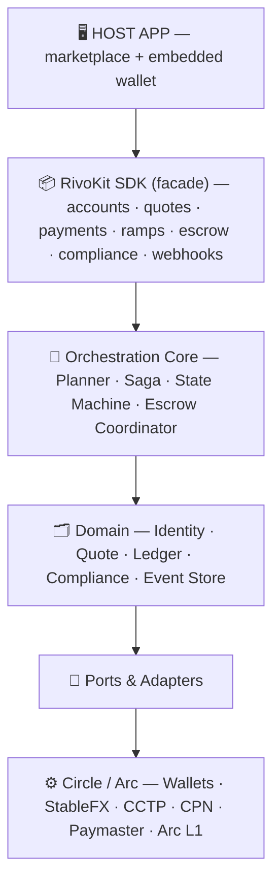
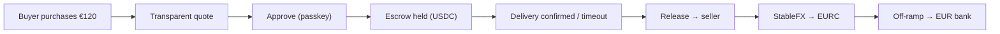

<div align="center">

# 🌊 RivoKit

### One intent. Every rail. Settled.
**_Where money finds its way._**

The non-custodial money-movement layer for stablecoins — built on **Arc** & **Circle**.

[](https://arc.io)
[]()
[]()
[]()

</div>

---

## What is RivoKit?

RivoKit is an **SDK** that transforms Circle's payment primitives (App Kit, StableFX, CCTP/Gateway, CPN, Circle Wallets, Paymaster) into **a single intent-based surface**. Instead of manually orchestrating swaps, bridges, escrows, and off-ramps, developers simply declare their desired outcome:

```ts
await rivo.pay({ to: "seller", amount: { amount: "120.00", currency: "EUR" } });
```

RivoKit determines **which route to take, in what order**, executes it across multiple rails, **recovers automatically from partial failures**, and cryptographically records **who paid whom**—all behind a single API call.

> **Analogy:** If StableFX is the interbank FX desk, RivoKit is Stripe or Wise—the layer that makes those rails usable with just a few lines of code.

---

## The Problem RivoKit Solves

A buyer in the United States holds **USDC**. A seller in Berlin wants **withdrawable EUR** without dealing with wallets or crypto exchanges. Traditional payment rails make connecting these two worlds slow, expensive, and dependent on multiple intermediaries.

RivoKit completes the entire flow: **USDC → (FX) → EURC → (off-ramp) → EUR in a bank account**, with non-custodial escrow in the middle, allowing the seller to receive fiat without ever touching cryptocurrency.

---

## Features

- 🎯 **Intent-based** — declare the outcome, not the payment primitives. Crypto remains completely invisible to end users.
- 🧭 **Automatic routing** — the Planner selects P2P, FX, bridge, and off-ramp paths across three dimensions (chain × currency × form factor).
- 🔒 **Non-custodial escrow** — smart contracts hold the funds; the platform can never move them unilaterally. Escrow is cryptographically bound to the buyer and seller.
- 🔁 **Multi-leg reliability (Saga)** — forward retries, compensating actions, and resting states ensure funds are never lost mid-transaction.
- 🧾 **Cryptographic attribution** — prove which buyer paid for which order **without memos or invoices**, even when multiple buyers purchase identical items.
- 🌉 **Cross-chain** — accepts deposits from Base and Solana via CCTP, using Arc as the settlement hub.
- 💸 **Transparent FX** — mid-market exchange rate with a separately disclosed margin (similar to Wise), never hidden inside the quoted rate.
- ⛽ **Gasless UX** — users pay gas fees in USDC (native on Arc; Circle Paymaster on spoke chains).

---

## System Architecture



**Hub-and-spoke principle:** the entire orchestration brain (escrow, FX, state machine, and ledger) resides on **Arc**, while other chains function as spokes for ingress and egress.

---

## How It Works (Core Flow)



The seller is considered "paid" only when **delivery is confirmed** (`settled`). Non-custodial escrow prevents premature fund release, while timeout mechanisms protect both parties.

---

## Monorepo

| Package | Description |
|---|---|
| `packages/contracts` | Non-custodial escrow smart contracts (Solidity/Foundry) + CREATE2 factory |
| `packages/sdk-core` | Shared TypeScript types (Money, Payment, Status, RoutePlan) |
| `packages/sdk-server` | Orchestration Core + domain services + ports/adapters |
| `packages/sdk-client` | Passkey connection, balance management, `pay`, and event subscriptions |
| `apps/demo-web` | Marketplace + embedded wallet (Next.js) |
| `apps/demo-api` | Demo backend (NestJS) + Saga worker |

---

## Tech Stack

**On-chain:** Solidity · Foundry · OpenZeppelin · EIP-3009 · CREATE2

**Backend:** Node.js 22+ · TypeScript · NestJS · viem · Circle SDK · BullMQ/Redis (→ Temporal)

**Data:** PostgreSQL (Supabase) · Drizzle/Prisma · Redis

**Frontend:** Next.js · Tailwind CSS · shadcn/ui · TanStack Query · Circle Wallets (WebAuthn/passkey) · Supabase Realtime

**Infrastructure:** pnpm + Turborepo · GitHub Actions · Vercel · Railway/Fly · Arc Testnet

---

## Getting Started

> Prerequisites: Node.js v22+, pnpm, Foundry, a Circle Developer account (TEST API key), and a StableFX TEST key (request one from Circle).

```bash
# 1. Clone & install
git clone https://github.com/<org>/rivokit.git && cd rivokit
pnpm install

# 2. Environment variables (do not commit)
cp .env.example .env
#   CIRCLE_API_KEY=TEST_...  CIRCLE_ENTITY_SECRET=...  STABLEFX_API_KEY=TEST_...
#   ARC_RPC=https://rpc.testnet.arc.network  DATABASE_URL=...  REDIS_URL=...

# 3. Get test USDC & EURC on Arc Testnet
#    → https://faucet.circle.com (select Arc Testnet)

# 4. Deploy contracts to Arc Testnet
pnpm --filter contracts deploy:testnet

# 5. Run the demo
pnpm --filter demo-api dev     # backend + worker
pnpm --filter demo-web dev     # marketplace + wallet
```

---

## Current Status & Known Limitations (Please Read Before Evaluating)

RivoKit is currently a **concept/MVP-stage project**. We are transparent about its current limitations:

- ⚠️ **Fiat rails (SEPA/ACH via CPN) are sandbox-only** — executed against the CPN testnet using magic values and clearly labeled within the UI. Production fiat payouts require a licensed OFI/BFI partner.
- ⚠️ **Non-custodial ends at the fiat boundary** — escrow and on-chain settlement remain non-custodial, while fiat off-ramping is inherently custodial through licensed financial institutions.
- ⚠️ **Not audited** — the MVP smart contracts are based on reference patterns. **Do not** use them with real funds before a professional security audit.
- ⚠️ **Not financial or legal advice** — regulatory questions surrounding money transmission, FX, and custody remain jurisdiction-dependent and must be reviewed by qualified legal counsel before mainnet deployment.
- ⚠️ **Current corridor scope:** USD ↔ EUR (supported stablecoin pair). Additional currencies are on the roadmap.

We **do not** claim to provide "cash-final settlement," "end-to-end non-custodial custody," "support for every currency," or "instant settlement." USDC can still be frozen by its issuer, and Arc is a centrally operated Layer-1 network.

---

## What's Next

- [ ] Fiat recipient mode without requiring a wallet (CPN beneficiary)
- [ ] Arbitrary multi-chain egress and direct spoke-to-spoke routing
- [ ] Production-grade KYC / Travel Rule support
- [ ] Durable Saga orchestration (Temporal) + full observability
- [ ] Arbitrator panel, staking, and dispute bonds
- [ ] Additional currency corridors
- [ ] Agentic Track (autonomous routing agent)
- [ ] Smart contract security audit

---

## Learn More

- 📘 [`CONCEPT.md`](./CONCEPT.md) — concepts, architecture, and final design decisions (source of truth)
- 📗 [`PRD.md`](./PRD.md) — product requirements, specifications, and implementation plan
- 📙 [`CLAUDE.md`](./CLAUDE.md) — contributor and AI agent development guide

---

## Contributing & License

Contributions are welcome through pull requests. Please read `CLAUDE.md` for architectural invariants that must not be violated.

License: **MIT** (see `LICENSE`).

---

## Acknowledgements

Built on top of [Arc](https://arc.io) and the [Circle Developer Platform](https://developers.circle.com). RivoKit is not officially affiliated with Circle; it is a third-party orchestration layer built on top of Circle's products.

<div align="center">

**RivoKit** — _Where money finds its way._

</div>
````
